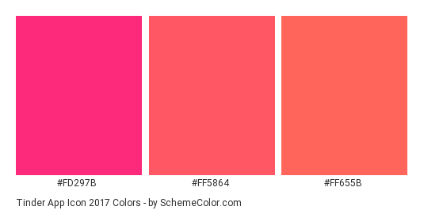

## **Especificação Suplementar - Versão Final**

 
### Versionamento

| Versão      	| Especificação Suplementar                                                   	|
| ------------- | ------------------------------------------------------------ |
| [**Versão 1**](EspSuplementarV1.md)	| Especificação Suplementar  |

 

## Finalidade:

&emsp;
Esta especificação suplementar busca tratar os requisitos não-funcionais não capturados pelos casos de uso.

 
## Escopo:

&emsp;
Esta especificação suplementar se aplica ao sistema do Tinder, em um estudo sobre modelagem de requisitos.

&emsp;
O Tinder é um aplicativo de relacionamento no qual pessoas avaliam outras pessoas por meio de fotos e breves descrições. Possibilitando posteriormente a interação entre pessoas que se avaliaram positivamente.

 
## Usabilidade:

#### Linguagem de fácil entendimento:

&emsp;
A linguagem utilizada em todas as telas e funcionalidades do sistema deve se encaixar no vocabulário do perfil de usuário mais comum que, de acordo com o questionário, são pessoas com idade de 18 à 25 anos.

#### Interface intuitiva e de fácil compreensão:

&emsp;
As telas do sistema devem possuir poucas opções de navegação, tornando-as simples e fáceis. As opções de navegação assim como os demais botões devem estar dispostos de maneira a minimizar riscos. Ex: botão de assinar serviço pago deve ser distante do botão de deletar conta.
Ícones devem ser claros em relação à seus objetivos.

&emsp;
Deve ser adotado um método simples de navegação e exploração das telas. Este método deve abranger a maior parte das operações de navegação da aplicação. O método em questão é o Swipe.

&emsp;
O Swipe (Deslizar) deve ser parte essêncial da principal funcionalidade da aplicação, que se resume em avaliar o perfil de outros usuários.  
Deslizar um perfil para esquerda significa uma avaliação negativa.
Deslizar um perfil para direita significa uma avaliação positiva.
A função de superlike tambem se aproveitará do Swipe, de modo que ao deslizar um perfil para cima, significará um superlike no perfil em questão.  
Além de abranger a funcionalidade de descoberta, a navegação entre as telas que representam diferentes funcionalidades, também deverá ser realizada através de Swipes.

&emsp;
Desse modo a usabilidade da aplicação obtém vantagens no que se refere à facilidade de aprendizagem do usuário, memorização de ações e intuitividade da interface.

 
## Confiabilidade:

#### Segurança ao guardar os dados do usuário:

&emsp;
Os dados do usuário referentes à autenticação e relacionamento com outras pessoas dentro do Tinder devem ser privados e consequentemente bem protegidos na base dados da empresa.

&emsp;
Não só os dados pessoais, mas também os dados de pagamento do usuário devem ser tratados com cuidado. Uma forma de alcançar esse objetivo é utilizar os sistemas de pagamentos ja existentes no Google Play e na App Store como intermediário nos pagamentos. Estes são sistemas já bem consolidados no contexto de pagamentos em aplicações móveis por conta de sua confiabilidade e qualidade em geral.

#### Segurança ao realizar a integração com as redes sociais (Facebook, Instagram, Spotify):

&emsp;
Ao solicitar integração de seu perfil com algum outro sistema, apenas os dados do sistema a ser integrado deverão ser importados, de forma que nenhuma informação sobre o comportamento ou se quer a existência de um usuário no tinder seja publicada em algum desses softwares.

&emsp;
Dessa forma deve-se adotar métodos de integração na qual sejam necessários o minimo de dados possível sobre o usuário, para que seja realizada a integração entre o Tinder e outro software.
Possíveis dados necessários para integração: 
- E-mail do usuário 
- ID do usuário do Tinder 
- Nome do usuário 

Quais quer outros dados além destes podem ser vistos como desnecessários para uma simples conexão entre as contas de um usuário em softwares distintos.

 
## Desempenho:
#### Tempo mínimo de resposta entre cada perfil avaliado:

&emsp;
A atividade de avaliar perfil consiste em arrastar cards para o lado direito ou esquerdo em caso de like ou deslike respectivamente. Logo é necessário que outro card substitua o card que foi arrastado para o lado. Caso o tempo de carregamento desse novo card seja lento, a principal tela do aplicativo se tornaria inútil durante esse tempo, piorando significativamente a experiência do usuário.

#### Tempo mínimo de respostas quando houver o match:

&emsp;
A tela que notifica o usuário que o match aconteceu, deve aparecer rapidamente e de forma invasiva, pois ela representa o objetivo da principal função do sistema(avaliar perfis) ser alcançado. Com isso o usuário tem noção em tempo real das consequências de suas avaliações.

##### Estratégia para alcancar tempos curtos de resposta:

&emsp;
Para alcançar um tempo curto de resposta, uma estratégia interessante é tornar a interface levemente independente da persistencia e busca de dados. Para isso devem ser utilizados algorítimos que realizem acessos aos dados periodicamente, e não em cada vez que usuário tornar este acesso necessário. Isso daria uma maior janela de tempo para as respostas do servidor, enquanto o usuário se mantem ocupado nas avaliações de perfil.

 
## Compatibilidade:
#### Suporte à plataforma Android:

&emsp;
Deve existir uma versão estável e otimizada para dispositivos móveis que utilizam o sistema operacional Android.

#### Suporte à plataforma IOS:

&emsp;
Deve existir uma versão estável e otimizada para dispositivos móveis que utilizam o sistema operacional IOS.

#### Suporte à plataforma Web:

&emsp;
O sistema deve ser acessível em navegadores web por meio de uma versão específica para eles.

#### Compatibilidade com versões de browser (Google Chrome, Mozilla Firefox, etc):

&emsp;
O sistema deve se comportar de forma idêntica em qualquer navegador web comum.

#### Compatibilidade com versões de sistemas operacionais móveis:

&emsp;
O sistema deve estar disponível para diversas versões de um sistema operacional como Android ou IOS. Deve-se levar em conta as limitações das versões mais antigas, que ocasionaram em diferenças entre versões do Tinder. Limitações do sistema operacional que interfiram de forma significativa nas principais funções do Tinder terão como consequência a não existência de uma versão do tinder para esta versão do sistema operacional.

 

 
## Padrões aplicáveis:

&emsp;
Paleta de cores:

&emsp;
Navegação e exploração da maior parte do sistema deve ser feita através de Swipes e Abas.

 
## Requisitos de Licenciamento

#### Licenças presentes no sistema:
Apache 2.0:
- Google Play Services
- Android InApp Billing v3
- Facebook Android SDK
- GSON
- OkHTTP
- okio
- libphonenumber
- EventBus
- Dagger
- AndroidSVG
- SVG-Android
- Volley
- Glide
- ViewPageIndicator
- RxAndroid
- Retrofit
- Android Image Cropper
- LicensesDialog

Stetho
Rebound
StreamSupport

